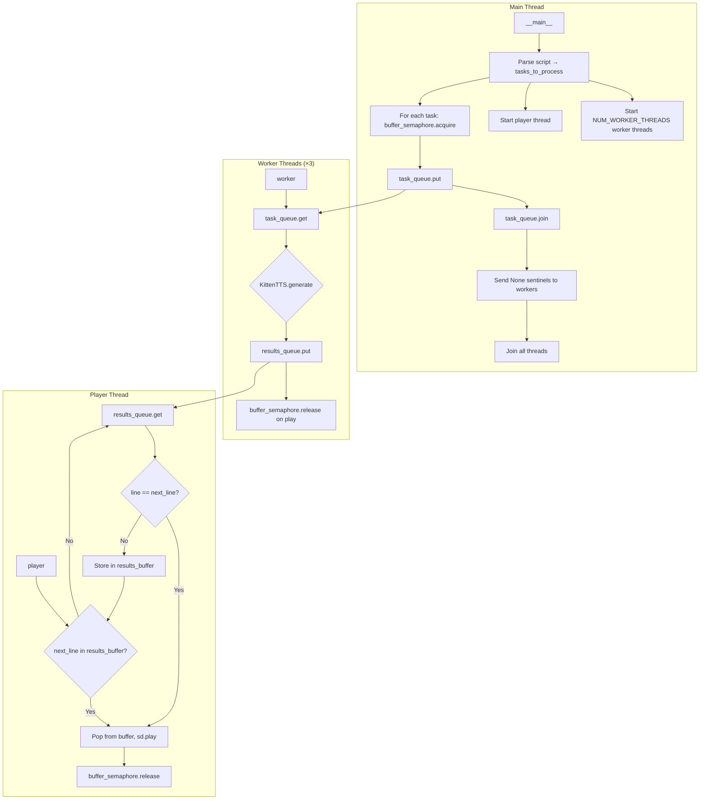

# app.py — Drama Script TTS Player

A multi-voice text-to-speech drama player that reads script files using KittenTTS, with parallel audio generation and ordered playback.

---

## Architecture Overview

```
┌─────────────────────────────────────────────────────────────────────────────────┐
│                              app.py — Main Application                          │
├─────────────────────────────────────────────────────────────────────────────────┤
│                                                                                 │
│  ┌──────────────┐     ┌─────────────────┐     ┌──────────────────────────────┐  │
│  │ Script File  │────▶│  Script Parser  │────▶│  tasks_to_process[]          │  │
│  │ (script_     │     │  (pre-parse)    │     │  (line, text, speed, voice)  │  │
│  │  drama.txt)  │     │                 │     └──────────────┬───────────────┘  │  
│  └──────────────┘     └─────────────────┘                    │                  │
│                                                              ▼                  │
│  ┌──────────────────────────────────────────────────────────────────────────┐   │
│  │                    Producer-Consumer Pipeline                            │   │
│  │                                                                          │   │
│  │   Main Thread (Producer)     task_queue      Worker Threads (Consumers)  │   │
│  │   ┌─────────────────┐      ┌─────────┐      ┌─────────────────────────┐  │   │
│  │   │ buffer_semaphore│─────▶│  Queue  │─────▶│  KittenTTS.generate()   │  │   │
│  │   │ .acquire() per  │      │ (FIFO)  │      │  (ML inference)         │  │   │
│  │   │ task enqueued   │      └─────────┘      └───────────┬─────────────┘  │   │   
│  │   └─────────────────┘             │                     │                │   │   
│  │                                   │                     ▼                │   │   
│  │                                   │            results_queue             │   │   
│  │                                   │            (PriorityQueue by line#)  │   │   
│  │                                   │                     │                │   │   
│  │                                   │                     ▼                │   │   
│  │   Player Thread                   │             ┌─────────────────┐      │   │   
│  │   ┌─────────────────────────────────────────────│  results_buffer │      │   │   
│  │   │  sd.play() + sd.wait()  ◀───────────────────│  (out-of-order  │      │   │   
│  │   │  (ordered playback)                         │   cache)        │      │   │   
│  │   └──────────────────────────────────────────── └─────────────────┘      │   │   
│  └──────────────────────────────────────────────────────────────────────────┘   │
│                                                                                 │
└─────────────────────────────────────────────────────────────────────────────────┘
```

---

## Call Graph



### Simplified Call Flow

```
main()
  ├── Parse script_drama.txt → tasks_to_process
  ├── threading.Thread(target=worker) × NUM_WORKER_THREADS
  ├── threading.Thread(target=player, args=(total_lines,))
  ├── for task in tasks_to_process:
  │     buffer_semaphore.acquire()
  │     task_queue.put((line, txt, speed, voice))
  ├── task_queue.join()
  ├── task_queue.put(None) × NUM_WORKER_THREADS  # stop workers
  └── join all threads

worker()
  ├── m = KittenTTS(dir + tts[1])  # Load model once per worker
  ├── loop:
  │     task = task_queue.get()
  │     if task is None: break
  │     audio_data = m.generate(txt, voice=voice, speed=speed)
  │     results_queue.put((line, txt, speed, voice, audio_data))
  └── task_queue.task_done()

player(total_lines)
  ├── next_line_to_play = 1
  ├── results_buffer = {}  # Cache for out-of-order results
  ├── loop until played_lines_count == total_lines:
  │     while next_line_to_play in results_buffer:
  │         pop, sd.play(), sd.wait(), buffer_semaphore.release()
  │     result = results_queue.get(timeout=10)
  │     if line == next_line_to_play: play immediately
  │     else: results_buffer[line] = result
  └── "Finished playing."
```

---

## Input Data for Speech

### Script Format

Scripts live in `scripts/` and use a pipe-delimited format:

```
VOICE|SPEED|TEXT
```

| Field | Description | Example |
|-------|-------------|---------|
| `VOICE` | Character voice name | `Leo`, `Bella`, `Jasper`, `Kiki`, `Luna`, `Rosie`, `Bruno` |
| `SPEED` | Base speed multiplier (float) | `1.2`, `1.4`, `1.0` |
| `TEXT` | Line to synthesize | `People think a quiet town is a safe town.` |

### Example (from `script_drama.txt`)

```
Leo|1.2|People think a quiet town is a safe town.
Leo|1.2|They hear crickets, see porch lights, and assume the universe is being polite.
Bella|1.4|Okay. Everyone stay together. No wandering. No "I'll be right back."
Jasper|1.3|I'm not wandering. I'm… strategically glued to the group.
```

### Parsing Rules

- Blank lines are skipped.
- Lines must have at least 3 pipe-separated parts.
- `speed` used in synthesis = `float(parts[1]) + SPEED_OFFSET` (default `SPEED_OFFSET = 0.2`).
- Curly apostrophes (`'`) are removed from text.
- Unknown voices fall back to `DEFAULT_VOICE` (`"Leo"`).

### Voice Mapping

| App Voice | Model Voice (expr-voice-*) |
|-----------|----------------------------|
| Bella     | expr-voice-2-f             |
| Luna      | expr-voice-3-f             |
| Rosie     | expr-voice-4-f             |
| Kiki      | expr-voice-5-f             |
| Jasper    | expr-voice-2-m             |
| Bruno     | expr-voice-3-m             |
| Leo       | expr-voice-5-m             |

---

## Models Used and Implementation

### Model Selection

`app.py` uses a local/HuggingFace model path:

```python
dir = "KittenML/"
tts = ["kitten-tts-mini-0.8", "kitten-tts-nano-0.8-fp32"]
# Used: dir + tts[1] → "KittenML/kitten-tts-nano-0.8-fp32"
```

Each worker loads:

```python
m = KittenTTS(dir + tts[1])  # kitten-tts-nano-0.8-fp32
```

### KittenTTS Pipeline

```
Text Input
    │
    ▼
┌─────────────────────┐
│ TextPreprocessor    │  (numbers, contractions, ordinals, etc.)
│ (kittentts/preprocess)│
└──────────┬──────────┘
           ▼
┌─────────────────────┐
│ chunk_text()        │  Split by sentences, max 400 chars
└──────────┬──────────┘
           ▼
┌─────────────────────┐
│ phonemizer          │  espeak-ng, en-us, with stress
│ (IPA phonemes)      │
└──────────┬──────────┘
           ▼
┌─────────────────────┐
│ TextCleaner         │  Char → token IDs (symbol vocabulary)
└──────────┬──────────┘
           ▼
┌─────────────────────┐
│ ONNX Inference      │  input_ids, style (voice ref), speed
│ (onnxruntime)       │
└──────────┬──────────┘
           ▼
┌─────────────────────┐
│ Audio trim          │  outputs[0][..., :-5000]
└──────────┬──────────┘
           ▼
    numpy float32 audio @ 24 kHz
```

### Model Architecture (KittenTTS)

- Based on **StyleTTS 2**.
- ONNX format, runs on CPU.
- `kitten-tts-nano-0.8-fp32`: ~15M params, ~56MB.
- Inputs: `input_ids`, `style` (from `voices.npz`), `speed`.
- Output: raw waveform at 24 kHz.

---

## Startup Variables

| Variable | Default | Description |
|----------|---------|-------------|
| `BUFFER_SIZE` | `5` | Max tasks in flight (semaphore limit). |
| `NUM_WORKER_THREADS` | `3` | Parallel TTS workers. |
| `SPEED_OFFSET` | `0.2` | Added to script speed (e.g. `1.2` → `1.4`). |
| `CONVERSATION_SOURCE` | `"script_drama.txt"` | Script filename in `scripts/`. |
| `DEFAULT_VOICE` | `"Leo"` | Fallback for unknown voices. |
| `dir` | `"KittenML/"` | Base path for model. |
| `tts` | `["kitten-tts-mini-0.8", "kitten-tts-nano-0.8-fp32"]` | Model list; index `1` is used. |
| `sample_rate` | `24000` | Output sample rate for playback. |

### Changing Script or Model

```python
# Use different script
CONVERSATION_SOURCE = "script_action1.txt"  # or script_hangout.txt, script_travel.txt

# Use mini model (index 0)
m = KittenTTS(dir + tts[0])  # kitten-tts-mini-0.8
```

---

## Thread Pooling and Audio Caching

### Design

- **Producer**: main thread enqueues tasks.
- **Consumers**: worker threads run TTS.
- **Player**: single thread plays audio in script order.

### Buffer Semaphore

`buffer_semaphore = Semaphore(BUFFER_SIZE)` limits how many tasks can be in progress:

1. Main thread: `buffer_semaphore.acquire()` before each `task_queue.put()`.
2. Player: `buffer_semaphore.release()` after each clip is played.

So at most `BUFFER_SIZE` (5) tasks are queued or being generated at once.

### Results Flow

```
Worker generates audio (order may differ from script)
        │
        ▼
results_queue (PriorityQueue) — not used for ordering in practice
        │
        ▼
player() — enforces order via results_buffer
```

### `results_buffer` (Out-of-Order Cache)

- `results_buffer: dict[int, tuple]` maps line number → `(line, txt, speed, voice, audio_data)`.
- When a result arrives for `next_line_to_play`, it is played immediately.
- When a result arrives for a future line, it is stored in `results_buffer[line]`.
- Player always checks `next_line_to_play in results_buffer` first, then pulls from `results_queue` if needed.

### Thread Summary

| Thread | Role |
|--------|------|
| Main | Parse script, enqueue tasks, coordinate shutdown. |
| Worker × 3 | Load KittenTTS, generate audio, put into `results_queue`. |
| Player | Consume `results_queue`, cache in `results_buffer`, play in order. |

---

## Audio Player

### Implementation

Playback uses **sounddevice** (`sd`):

```python
sd.play(audio_data, sample_rate)  # sample_rate = 24000
sd.wait()  # Block until playback finishes
```

### Behavior

- `audio_data`: float32 numpy array from KittenTTS.
- `sample_rate`: 24000 Hz.
- Playback is blocking per clip (`sd.wait()`).
- Clips are played strictly in script order (1, 2, 3, …).

### Dependencies

- `sounddevice` — cross-platform audio I/O.
- Uses default output device; no device selection in `app.py`.

---

## Data Flow Summary

```
script_drama.txt
       │
       ▼
[Parse] → tasks_to_process: [(1, txt, 1.4, "Leo"), (2, txt, 1.4, "Leo"), ...]
       │
       ▼
[Main] buffer_semaphore.acquire() → task_queue.put()
       │
       ├──────────────────────────────────────┐
       ▼                                      ▼
[Worker 1]  [Worker 2]  [Worker 3]      [Player]
  generate    generate    generate         │
       │          │          │             │
       └──────────┴──────────┴─────────────┤
                      │                    │
                      ▼                    ▼
              results_queue    results_buffer (cache)
                      │                    │
                      └────────────────────┤
                                           ▼
                                    sd.play() → sd.wait()
                                           │
                                           ▼
                                    buffer_semaphore.release()
```

---

## File Structure

```
KittenTTS/
├── app.py                 # This application
├── app_readme.md          # This documentation
├── conversation.py       # Legacy; CONVERSATION_SOURCE can override
├── kittentts/             # KittenTTS library
│   ├── __init__.py
│   ├── get_model.py       # KittenTTS class, HuggingFace download
│   ├── onnx_model.py      # KittenTTS_1_Onnx, phonemizer, ONNX inference
│   └── preprocess.py      # TextPreprocessor
├── KittenML/              # Local model configs (or HF cache)
│   ├── kitten-tts-mini-0.8/
│   └── kitten-tts-nano-0.8-fp32/
└── scripts/
    ├── script_drama.txt   # Default script
    ├── script_action1.txt
    ├── script_hangout.txt
    └── script_travel.txt
```
